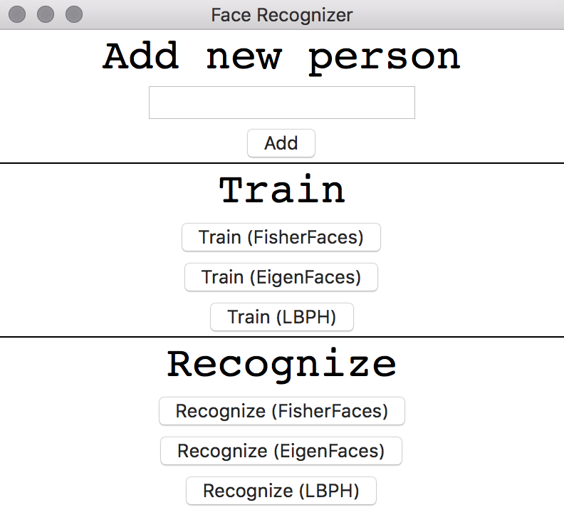
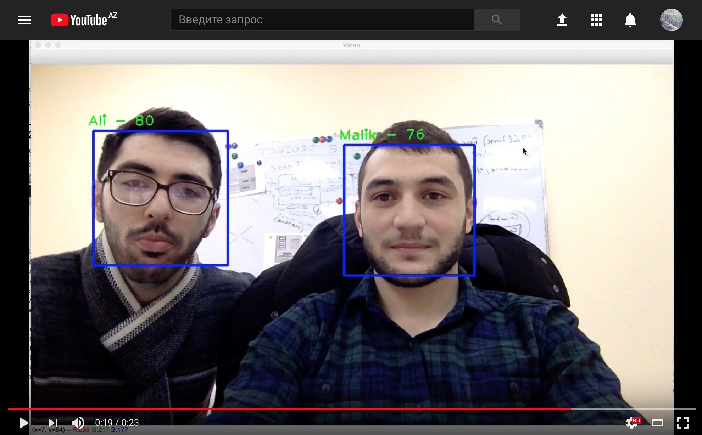

Face Detection and Recognition with OpenCV (Python)
=========================
- **face_data_samples** (Contains 2 samples, 100 captures for each person)
- **haarcascades** (Containes XML files already trained for the face detection)
- **README.md**
- **add_person.py** (Script to add new person to the face_data)
- **gui.py** (GUI)
- **recog_eigen.py** (Script to recognize faces using EigenFaces algorithm)
- **recog_fisher.py** (Script to recognize faces using FisherFaces algorithm)
- **recog_lbph.py** (Script to recognize faces using LBPH algorithm)
- **train_eigen.py** (Script to train the face recognition system using EigenFaces algorithm)
- **train_fisher.py** (Script to train the face recognition system using FisherFaces algorithm)
- **train_lbph.py** (Script to train the face recognition system using LBPH algorithm)

Dependencies
---------
- opencv
- opencv-python
- numpy

How to use ?
---------
Run gui.py file to open main window.

EigenFaces and LBPH algorithms requires as minimum 1 person to be added.

**Note that FisherFaces requires at least two persons trained, for LDA to work.**

Enter person name and click "**Add**" button to add new person to **face_data**

Then you can train face recognition system by choosing one of the algorithms.

If the training has completed successfully, you can recognize faces.

See youtube example

You can use sample face data. Rename **face_data_samples** to **face_data** or move **face_data_samples** content to **face_data**.

There is a difference between the confidence values reported by the algorithms - FisherFaces and LBPH results in much lower confidence values (=> more accurate)than EigenFaces.

## FisherFaces Example

## EigenFaces Example

## LBPH Example

### Bonus
Face recogniton system built with deep learning using dlib
To run this example replace the **known_face.png** file with your photo, then run gui.py script and click "**Recognize (dlib - Deep Learning)**" button.

This script is built using [**face_recognition** library](https://github.com/ageitgey/face_recognition).
